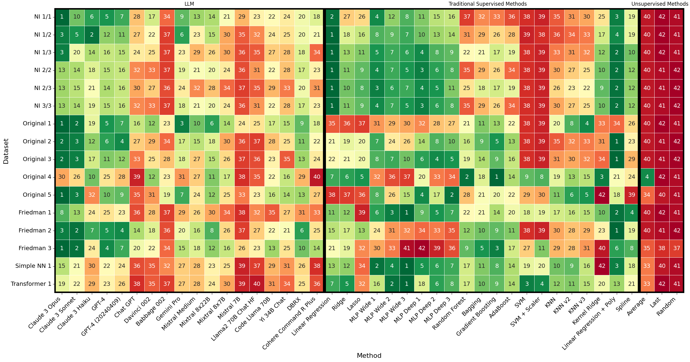
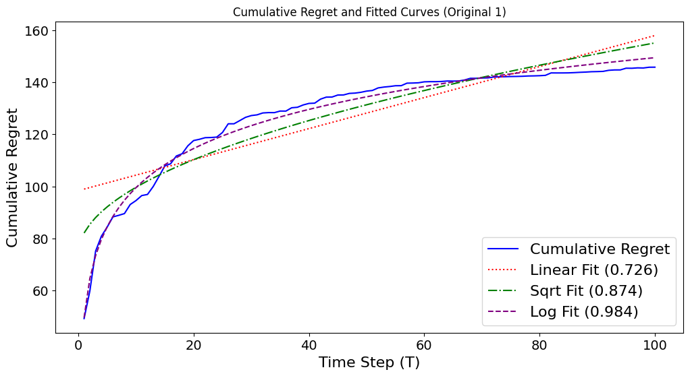

# LLMs Can Do Regression
This project explores the extent to which LLMs can do regression when given (input, output) pairs as in-context examples.

Preprint available on ArXiv: [From Words to Numbers: Your Large Language Model Is Secretly A Capable Regressor When Given In-Context Examples](https://arxiv.org/pdf/2404.07544.pdf).

Please refer to the [FAQ.md](./FAQ.md) for answers to some common questions. 

Examples of GPT-4 chats with full prompts are available in [data/prompts/README.md](./data/prompts/README.md). For example, [GPT-4 predicts `726.89` on Friedman #2, while gold is `689.01`](https://chat.openai.com/share/78298975-19d5-4731-b29b-7a60fae88bd3). (Note: we used API for all our experiments; we included Chat links just as simple examples)

## TL;DR: 
LLMs perform surprisingly well. 
Despite no parameter updates, Claude 3 Opus consistently performs better than traditional methods such as Gradient Boosting or Random Forest. 
Strong performance is present in open-weights models such as DBRX or Mixtral 8x22B as well. 
For example, both DBRX and Mixtral rank higher, on average, than Random Forest.

## Models
We use three types of models:
- Large Language Models (e.g., GPT-4, Claude 3, DBRX, Llama, etc)
- Traditional Supervised Methods (e.g., Linear Regression, Gradient Boosting, Random Forest, KNN, etc)
- Unsupervised Heuristics (e.g., just predict the average, etc)

We describe them in greater detail below.


### LLM
We use over 20 large language models (LLMs), such as GPT-4, Claude 3, or DBRX, either through pay-per-token services or deployed locally. All the LLMs used are available in the table below.

| LLM                              | How was used                                      | Additional details                                                              |
| -------------------------------- | ------------------------------------------------- | ------------------------------------------------------------------------------- |
| GPT-4                            | OpenAI API                                        | `gpt-4-0125-preview`                                                            |
| GPT-4 (20240409)                 | OpenAI API                                        | `gpt-4-turbo-2024-04-09`                                                        |
| Chat GPT                         | OpenAI API                                        | `gpt-3.5-turbo-1106`                                                            |
| Davinci 002                      | OpenAI API                                        | `davinci-002`                                                                   |
| Babbage 002                      | OpenAI API                                        | `babbage-002`                                                                   |
| Claude 3 Opus                    | OpenRouter                                        | `anthropic/claude-3-opus`                                                       |
| Claude 3 Sonnet                  | OpenRouter                                        | `anthropic/claude-3-sonnet`                                                     |
| Claude 3 Haiku                   | OpenRouter                                        | `anthropic/claude-3-haiku`                                                      |
| Claude 2.1                       | OpenRouter                                        | `anthropic/claude-2.1`                                                          |
| Claude 2.0                       | OpenRouter                                        | `anthropic/claude-2.0`                                                          |
| Claude 1.2                       | OpenRouter                                        | `anthropic/claude-1.2`                                                          |
| Gemini Pro                       | OpenRouter                                        | `google/gemini-pro`                                                             |
| Mistral Medium                   | OpenRouter                                        | `mistralai/mistral-medium`                                                      |
| Cohere Command                   | OpenRouter                                        | `cohere/command`                                                                |
| Cohere Command R                 | OpenRouter                                        | `cohere/command-r`                                                              |
| Cohere Command R Plus            | OpenRouter                                        | `cohere/command-r-plus`                                                         |
| DBRX                             | Fireworks                                         | `accounts/fireworks/models/dbrx-instruct`                                       |
| Mixtral Mixture of Experts 8x22B | Fireworks                                         | `accounts/fireworks/models/mixtral-8x22b`                                       |
| Mixtral Mixture of Experts 8x7B  | DeepInfra                                         | `mistralai/Mixtral-8x7B-Instruct-v0.1`                                          |
| Mistral 7B v2                    | DeepInfra                                         | `mistralai/Mistral-7B-Instruct-v0.2`                                            |
| Mistral 7B                       | DeepInfra                                         | `mistralai/Mistral-7B-Instruct-v0.1`                                            |
| Llama 2 70B Chat                 | DeepInfra                                         | `meta-llama/Llama-2-70b-chat-hf`                                                |
| Code Llama 2 70B Instruct        | DeepInfra                                         | `codellama/CodeLlama-70b-Instruct-hf`                                           |
| Yi 34B Chat                      | DeepInfra                                         | `01-ai/Yi-34B-Chat`                                                             |
| Falcon 40B                       | Locally with TGI                                  | `tiiuae/falcon-40b` quantized to 8bits with `bitsandbytes` through TGI          |
| Falcon 40B Instruct              | Locally with TGI                                  | `tiiuae/falcon-40b-instruct` quantized to 8bits with `bitsandbytes` through TGI |
| StripedHyena Nous 7B             | OpenRouter                                        | `togethercomputer/stripedhyena-nous-7b`                                         |
| RWKV v4 14B                      | Locally with Huggingface (`AutoModelForCausalLM`) | `rwkv-v4-14b`                                                                   |


### Traditional Supervised Methods
We use over 20 traditional supervised methods typically used for regression (e.g., Gradient Boosting). We use models found in sklearn. We include in additional details the model name and any default parameter changes.
We used `<..>` for some parameters that are omitted for brevity (e.g., random state).


| Model Name               | Additional Details                                                                                                    |
| ------------------------ | --------------------------------------------------------------------------------------------------------------------- |
| Linear Regression        | `LinearRegression`                                                                                                    |
| Ridge                    | `Ridge`                                                                                                               |
| Lasso                    | `Lasso`                                                                                                               |
| MLP Wide 1               | `MLPRegressor(hidden_layer_sizes=(10, ), activation='relu', <..>)`                                                    |
| MLP Wide 2               | `MLPRegressor(hidden_layer_sizes=(100, ), activation='relu', <..>)`                                                   |
| MLP Wide 3               | `MLPRegressor(hidden_layer_sizes=(1000, ), activation='relu', <..>)`                                                  |
| MLP Deep 1               | `MLPRegressor(hidden_layer_sizes=(10, 10), activation='relu', <..>)`                                                  |
| MLP Deep 2               | `MLPRegressor(hidden_layer_sizes=(10, 20, 10), activation='relu', <..>)`                                              |
| MLP Deep 3               | `MLPRegressor(hidden_layer_sizes=(10, 20, 30, 20, 10), activation='relu', <..>)`                                      |
| Random Forest            | `RandomForestRegressor(max_depth=3, <..>)`                                                                            |
| Bagging                  | `BaggingRegressor`                                                                                                    |
| Gradient Boosting        | `GradientBoostingRegressor`                                                                                           |
| AdaBoost                 | `AdaBoostRegressor(n_estimators=100, <..>)`                                                                           |
| SVM                      | `SVR`                                                                                                                 |
| SVM + Scaler             | `make_pipeline(StandardScaler(), SVR())`                                                                              |
| KNN v1                   | `KNeighborsRegressor`                                                                                                 |
| KNN v2                   | `KNeighborsRegressor(weights='distance')`                                                                             |
| Kernel Ridge             | `KernelRidge`                                                                                                         |
| Linear Regression + Poly | `Pipeline([('poly', PolynomialFeatures(degree=degree)), ('linear', LinearRegression())])`                             |
| Spline                   | `Pipeline([('spline', SplineTransformer(n_knots=n_knots, degree=degree)), ('linear', LinearRegression())])`           |
| KNN v3                   | `KNeighborsRegressor(n_neighbors=3, weights='distance')`                                                              |
| KNN v4                   | `KNeighborsRegressor(n_neighbors=1, weights='distance')`                                                              |
| KNN v5                   | `KNeighborsRegressor(n_neighbors=n_neighbors, weights='distance')` (`n_neigbors` depends on the number of datapoints) |


### Unsupervised Heuristics
We use heuristic-inspired baselines.
| Name    | Additional Details                                                                   |
| ------- | ------------------------------------------------------------------------------------ |
| Average | Predict the average output of the train partition                                    |
| Last    | Predict the value corresponding to the last value in the train partition             |
| Random  | Predict the value corresponding to a randomly sampled value from the train partition |

## Average Ranks
We show below a comparison between a subset of the models we used:
- **LLMs**: 9 large language models (LLMs), both open and private:
  - Open: DBRX, Mixtral 8x22b, Mixtral 8x7B
  - Private: Claude 3 Opus, Claude 3 Sonnet, GPT-4, GPT-4 (20240409), Chat GPT, Gemini Pro 
- **Traditional Supervised Methods**: 5 traditional methods:
  - Linear Regression + Poly, Linear Regression, Gradient Boosting, Random Forests
- **Unsupervised Methods**: 3 unsupervised methods:
  - Average, Random, Last

For each of the 16 datasets used, we calculate the corresponding rank for each model. For each dataset, the performance was obtained by calculating the mean across 100 random runs. We average the resulting ranks across all datasets and sort based on which model obtained the best rank. 
For example, on this set of models, Claude 3 Opus obtains the best rank on average, outperforming all traditional supervised methods. Both DBRX and Mixtral 8x22B outperform, on average, Random Forest. 


| Model Name               | Average Rank Across Linear Datasets | Average rank Across Original Datasets | Average Rank Across Friedman Datasets | Average Rank Across NN Datasets | Average Rank Across Non-Linear Datastes | Overall |
| ------------------------ | ----------------------------------- | ------------------------------------- | ------------------------------------- | ------------------------------- | --------------------------------------- | ------- |
| Claude 3 Opus            | 2.50                                | 3.8                                   | 2.00                                  | 5.5                             | 3.6                                     | 3.18    |
| Linear Regression + Poly | 2.33                                | 6.4                                   | 2.33                                  | 2.5                             | 4.4                                     | 3.62    |
| Claude 3 Sonnet          | 5.33                                | 4.0                                   | 2.66                                  | 7.0                             | 4.2                                     | 4.62    |
| GPT-4                    | 5.00                                | 5.8                                   | 6.00                                  | 8.0                             | 6.3                                     | 5.81    |
| Linear Regression        | 1.16                                | 11.0                                  | 9.00                                  | 2.5                             | 8.7                                     | 5.87    |
| GPT-4 (20240409)         | 5.50                                | 6.2                                   | 6.00                                  | 10.5                            | 7.0                                     | 6.43    |
| Gradient Boosting        | 9.50                                | 5.6                                   | 5.33                                  | 2.0                             | 4.8                                     | 6.56    |
| DBRX                     | 7.83                                | 8.2                                   | 8.66                                  | 10.5                            | 8.8                                     | 8.43    |
| Mixtral 8x22B            | 9.66                                | 7.0                                   | 9.00                                  | 9.0                             | 8.0                                     | 8.62    |
| Gemini Pro               | 7.66                                | 7.6                                   | 10.66                                 | 12.0                            | 9.4                                     | 8.75    |
| Random Forest            | 12.33                               | 8.8                                   | 7.66                                  | 5.5                             | 7.8                                     | 9.50    |
| KNN                      | 12.66                               | 10.2                                  | 11.33                                 | 3.0                             | 9.1                                     | 10.43   |
| Mixtral 8x7B             | 11.50                               | 10.2                                  | 12.33                                 | 13.0                            | 11.4                                    | 11.43   |
| Chat GPT                 | 12.00                               | 13.0                                  | 12.00                                 | 15.0                            | 13.1                                    | 12.68   |
| Average                  | 15.00                               | 12.2                                  | 15.00                                 | 14.0                            | 13.4                                    | 14.00   |
| Random                   | 16.50                               | 16.6                                  | 16.33                                 | 16.5                            | 16.5                                    | 16.50   |
| Last                     | 16.50                               | 16.4                                  | 16.66                                 | 16.5                            | 16.5                                    | 16.50   |

Code to generate this table is available in [how_to_create_plots_and_tables.md](./how_to_create_plots_and_tables.md#How-to-get-an-average-rank-table-like-in-the-`README.md`).


## Datasets
We used various linear and non-linear synthetic datasets. The exact definitions are available in `src/dataset_utils.py`. We did not add noise.

| Name              | Additional Details                                                                                                             | Definition                                                                                                      |
| ----------------- | ------------------------------------------------------------------------------------------------------------------------------ | --------------------------------------------------------------------------------------------------------------- |
| Regression NI 1/1 | A random linear regression dataset with 1 informative variable and 1 total variable                                            | Please check [sklearn](https://scikit-learn.org/stable/modules/generated/sklearn.datasets.make_regression.html) |
| Regression NI 1/2 | A random linear regression dataset with 1 informative variable and 2 total variables                                           | Please check [sklearn](https://scikit-learn.org/stable/modules/generated/sklearn.datasets.make_regression.html) |
| Regression NI 1/3 | A random linear regression dataset with 1 informative variable and 3 total variables                                           | Please check [sklearn](https://scikit-learn.org/stable/modules/generated/sklearn.datasets.make_regression.html) |
| Regression NI 2/2 | A random linear regression dataset with 2 informative variables and 2 total variables                                          | Please check [sklearn](https://scikit-learn.org/stable/modules/generated/sklearn.datasets.make_regression.html) |
| Regression NI 2/3 | A random linear regression dataset with 2 informative variables and 3 total variables                                          | Please check [sklearn](https://scikit-learn.org/stable/modules/generated/sklearn.datasets.make_regression.html) |
| Regression NI 3/3 | A random linear regression dataset with 3 informative variables and 3 total variables                                          | Please check [sklearn](https://scikit-learn.org/stable/modules/generated/sklearn.datasets.make_regression.html) |
| Friedman #1       | The Friedman #1 dataset  ([sklearn](https://scikit-learn.org/stable/modules/generated/sklearn.datasets.make_friedman1.html))   | $10 sin(x_0 x_1 \pi) + 20 \cdot (x_2 - 0.5) ^ 2 + 10 x_3 + 5 x_4$                                               |
| Friedman #2       | The Friedman #2 dataset  ([sklearn](https://scikit-learn.org/stable/modules/generated/sklearn.datasets.make_friedman2.html))   | $\sqrt{x_0 ^ 2 + (x_1 * x_2  - \frac{1}{x_1 x_3}) ^ 2}$                                                                                                              |
| Friedman #3       | The Friedman #3 dataset  ([sklearn](https://scikit-learn.org/stable/modules/generated/sklearn.datasets.make_friedman3.html))   | $arctan(\frac{x_1 * x_2 - \frac{1}{x_1 * x_3}}{x_0})$                                                                                                              |
| Original #1       | A dataset with a single input variable, similar to a line with oscillations (by adding `sin` and `cos`)                        | $x + 10sin(\frac{5\pi x}{100}) + 10cos(\frac{6\pi x}{100})$ |
| Original #2       | A dataset inspired by Friedman #2, but changing the domain of the input variable and some operants (e.g., $^2 \rightarrow ^4$) | $(x_0 ^ 4 + (x_1 * x_2 - \frac{2}{\sqrt{x_1} * \sqrt{x_3}})^2) ** 0.75$                                         |
| Original #3       | Trying more operands (e.g., $e^x$)                                                                                             | $e ^ {x_0} + \frac{x_1 x_2}{\sqrt{x_3}} + (x_0  x_3) ^ \frac{3}{2}$|
| Original #4       | Trying more operands together (sin, cos, log, sqrt, fractions)                                                                 | $\frac{x_1}{10} sin(x_0) + \frac{x_0}{10} cos(x_1) + \frac{\sqrt{x_0} log(x_1)}{\sqrt{x_1} log(x_0)}$                                                                                                                |
| Original #5       | Trying softmax                                                                                                                 | `100 * softmax(x/10, axis=-1).max(axis=-1)`                                                                                                                |
| Simple NN 1       | Initializing a random neural network and running it over random input. The output is considered gold                           | See `get_random_nn1`         in `src/dataset_utils.py`                                                                                                        |
| Transformer 1     | Initializing a random transformer encoder block and running random data. The output is considered gold                         | See `get_random_transformer` in `src/dataset_utils.py`                                                                                                                |
| Character         | Mapping random characters (e.g., `a`) to a numeric value. Then sampling a vector to map back the characters                    | See `get_character_regression` in `src/dataset_utils.py`                                                                                                                |

## Results At A Glance
The heatmap below is structured into 3 blocks: (1) LLMs (left), (2) Traditional Supervised Methods (middle), and (3) Unsupervised baseline (right). Each model had access to the same dataset, containing 50 (input, output) examples and was asked to predict the output corresponding to the same test sample. The performance is averaged across 100 random runs.

Overall, LLMs *generally* outperform the unsupervised heuristics, suggesting that the in-context learning mechanism is more complex than such simple heuristics.

Certain LLMs, both private (e.g., Claude 3 Opus, GPT-4) and open (e.g., DBRX) can outperform supervised methods such as KNN, Gradient Boosting, or Random Forest. For example, except on the datasets derived from neural networks (and `Original 4`), Claude 3 Opus outperforms KNN, Gradient Boosting, and Random Forest on **all** datasets. This strong performance persists until at least 500 examples (Appendix O in the [arxiv paper](https://arxiv.org/pdf/2404.07544.pdf)).

### Rank Heatmap




### Adaptation
Borrowing from the Online Learning community, we empirically analyze how the cumulative regret (i.e., cumulative loss) grows with respect to the time step (number of examples in context). We ran up to 100 time steps and average the results across 3 random runs. We included in Appendix O in the [arxiv paper](https://arxiv.org/pdf/2404.07544.pdf) how the performance of GPT-4 scales with up to 500 examples. GPT-4 still performs well. For example, it outperforms Random Forest in 92% of the cases.

Best curve fit table:

| model                    | friedman1 | friedman2 | friedman3 | original1 | original2 | regression_ni13 | regression_ni22 |
| ------------------------ | --------- | --------- | --------- | --------- | --------- | --------------- | --------------- |
| Claude 3 Opus            | linear    | sqrt      | sqrt      | log       | sqrt      | log             | log             |
| GPT-4                    | linear    | sqrt      | sqrt      | log       | sqrt      | log             | sqrt            |
| DBRX                     | linear    | log       | linear    | log       | sqrt      | sqrt            | sqrt            |
| Mixtral 8x7B             | linear    | linear    | linear    | sqrt      | linear    | linear          | sqrt            |
| AdaBoost                 | linear    | sqrt      | linear    | sqrt      | sqrt      | sqrt            | sqrt            |
| Gradient Boosting        | sqrt      | sqrt      | linear    | log       | sqrt      | log             | sqrt            |
| Linear Regression        | linear    | linear    | linear    | linear    | linear    | log             | log             |
| Linear Regression + Poly | sqrt      | log       | log       | linear    | log       | log             | log             |
| Random Forest            | linear    | sqrt      | linear    | sqrt      | sqrt      | sqrt            | linear          |


Claude 3 Opus on `Original 1`




## Can it be contamination?

To answer this question we: 
(1) tested the models on datasets where we wrote the underlying functions ourselves; 
(2) used models like Falcon where the training data is openly available; 
(3) analyzed whether the performance changes if the LLMs know the dataset name.

We found: 
(1) LLMs perform well on these new "original" datasets; 
(2) Falcon performance is also strong, albeit not to the level of the newer models. Nevertheless, Falcon outperforms MLP regressors on `Original 1`; 
(3) The performance of models does not significantly changes if they have access to the name of the dataset they will be tested on.

## Data

The resulting data for all models can be found in `data/outputs`. Please see [how_to_create_plots_and_tables.md](./how_to_create_plots_and_tables.md) for examples on how to interact with it.

## How to

### How to add a new dataset?
Please check [hot_to_add_dataset.md](./how_to_add_dataset.md).

### How to add a new model?
Please check [hot_to_add_model.md](./hot_to_add_model.md).

### How to recreate some of the plots/tables
Please check [how_to_create_plots_and_tables.md](./how_to_create_plots_and_tables).

There are examples on how to interact with the data there.

### How to see how a prompt looks like
Please run the following command, inside this folder.

First, run `python`, then:

```python
from src.dataset_utils import get_dataset
from src.regressors.prompts import construct_few_shot_prompt

# Get the dataset
((x_train, x_test, y_train, y_test), y_fn) = get_dataset('original1')(max_train=2, max_test=1, noise=0, random_state=1, round=True, round_value=2)

# The instruction prefix we used
instr_prefix='The task is to provide your best estimate for "Output". Please provide that and only that, without any additional text.\n\n\n\n\n'

fspt = construct_few_shot_prompt(x_train, y_train, x_test, encoding_type='vanilla')
inpt = instr_prefix + fspt.format(**x_test.to_dict('records')[0])
print(inpt)
```

You should see the following output:
```
The task is to provide your best estimate for "Output". Please provide that and only that, without any additional text.


Feature 0: 0.01
Output: 10.03

Feature 0: 72.03
Output: 67.84

Feature 0: 41.7
Output:
```

Additionally, there is an example in `prompt.txt`. 

More examples, together with links to Chat (note, however, that we used the API; This is just to be used as an example) can be found in `data/prompts`.

### How to re-run some experiments
Please see the folders in `src/experiments`. Each folder contains a `README.md` file with additional explanations, including the reasoning behind the experiment. You will need specific API keys for models such as Claude, GPT-4, etc. I used the following files: (1) `api.key` for OpenAI, (2) `api_deepinfra_personal.key` for DeepInfra, (3) `api_openrouter_personal.key` for OpenRouter, and (4) `api_fireworks_personal.key` for Fireworks.

(1) For the regression performance, over both linear and non-linear datasets, please check the files in `src/experiments/regression_performance`.
For example, to re-run GPT-4, just run `python -m src.experiments.regression_performance.regression_performance_openai`. Please note that this command will re-run every dataset with `gpt-4-0125-preview`. Please change the code if you have different requirements.

(2) For the adaptation (online learning) experiments, please see `src/experiments/regression_fast_adaptation`.

(3) For the plateauing experiments, please see `src/experiments/regression_plateauing`.

(4) For generating justifications, please see `src/experiments/regression_justifications`.

(5) For contamination experiments, please see `src/experiments/regression_contamination_check`.


The outputs of the above experiments are released and available at `data/outputs`. Please see [how_to_create_plots_and_tables.md](./how_to_create_plots_and_tables.md) for examples on how to interact with it and how to create the plots and tables used here.

