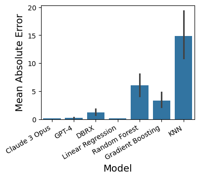
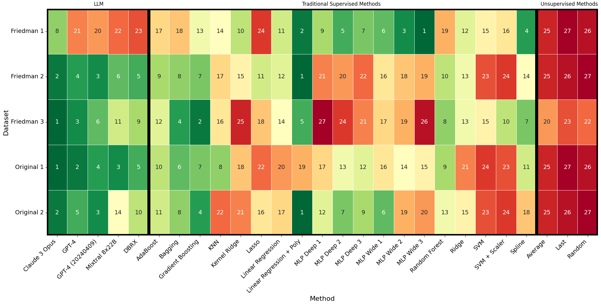

# How to do some of the plots/tables from the paper

## How to do a barplot (e.g., Figure 1)
```python
import seaborn as sns
import matplotlib.pyplot as plt
import pandas as pd
df = pd.read_json('data/outputs/lr_nlr.json')
# Subset of models
cdf = df[df['model'].isin(['Claude 3 Opus', 'GPT-4', 'DBRX', 'Linear Regression', 'Random Forest', 'Gradient Boosting', 'KNN'])]
# Only one dataset
cdf = cdf[cdf['dataset'] == 'regression_ni12']

plt.figure(figsize=(4,3))
sns.barplot(data=cdf, x='model', y='l1')
plt.xticks(rotation=30, ha='right')
plt.xlabel('Model', fontsize=14)
plt.ylabel('Mean Absolute Error', fontsize=14)
# plt.savefig('example_single_group_barplot.png')
```
Example of output:



## How to do a 3-group barplot
```python
import pandas as pd
import matplotlib.pyplot as plt
import seaborn as sns
df = pd.read_json('data/outputs/lr_nlr.json')


rename_dict = {
    'Linear Regression': 'LR',
    'Linear Regression + Poly': 'LR + Poly',
    'GPT4': 'GPT-4',
    'Claude 3 Opus': 'Claude 3',
    'MLP Wide 1': 'MLP',
    'Gradient Boosting': 'GBR',
    'Random Forest': 'RF',
}


cdf = df[df['group'] == 'Traditional Supervised Model']
cdf = cdf.groupby(by = ['dataset', 'model', 'group'])['l1'].agg('mean').reset_index()
top5_per_dataset = cdf.groupby('dataset', group_keys=False).apply(lambda x: x.nsmallest(5, 'l1'))

llm_models_considered                    = ['GPT-4', 'Claude 3 Opus', 'Mixtral 8x22B', 'DBRX']
traditional_supervised_models_considered = ['Linear Regression', 'MLP Wide 1', 'Gradient Boosting', 'Random Forest']
unsupervised_models_considered           = ['Average', 'Random']


dataset = 'friedman2'
fig, axes = plt.subplots(nrows=1, ncols=3, figsize=(8, 3), sharey=True, gridspec_kw={'width_ratios': [1, 1, 0.4]})
current_df = df[df['dataset']==dataset]

# Get the best performing model
best_in_hindsight = top5_per_dataset[top5_per_dataset['dataset'] == dataset]
best_in_hindsight = best_in_hindsight[~best_in_hindsight['model'].isin(traditional_supervised_models_considered)]
current_df = current_df[current_df['model'].isin(llm_models_considered + traditional_supervised_models_considered + unsupervised_models_considered + [best_in_hindsight.iloc[0].model])]
current_df['model'] = current_df['model'].replace(rename_dict)
for i, group in enumerate(current_df['group'].unique()):
    sns.barplot(data=current_df[current_df['group'] == group], x='model', y='l1', ax=axes[i])
    axes[i].set_xlabel('')
    axes[i].set_ylabel('')
    axes[i].set_title(group, fontsize=12)
    axes[i].set_xticklabels(axes[i].get_xticklabels(), rotation=30, ha="right", fontsize=12)

plt.tight_layout()

fig.supxlabel("Model", fontsize=16, y=-0.05)
fig.supylabel("Mean Absolute Error", fontsize=12, x=-0.01)
plt.subplots_adjust(wspace=0.1)
# plt.savefig('example_three_group_barplot.png')
```
Example of output:


## How to do a rank heatmap
The code below is for creating rank heatmaps.
To use different models, please change `model_order`. For different dataets, please change `datasets`.
Please note that the code might need some minor adjustments. For example, which model is LLM, which is Traditional Supervised Methods, and which Unsupervised Methods. It can be done automatically using the `group` field.

```python
# Part 1: Create the heatmap data
##########################
import pandas as pd
import matplotlib.pyplot as plt
import seaborn as sns
df = pd.read_json('data/outputs/lr_nlr.json')

# What models to consider
model_order = [
    # LLMs
    'Claude 3 Opus',
    'GPT-4',
    'GPT-4 (20240409)',
    'Mixtral 8x22B',
    'DBRX',    
    # Traditional Supervised Methods
    'AdaBoost',
    'Bagging',
    'Gradient Boosting',
    'KNN',
    'Kernel Ridge',
    'Lasso',
    'Linear Regression',
    'Linear Regression + Poly',
    'MLP Deep 1',
    'MLP Deep 2',
    'MLP Deep 3',
    'MLP Wide 1',
    'MLP Wide 2',
    'MLP Wide 3',
    'Random Forest',
    'Ridge',
    'SVM',
    'SVM + Scaler',
    'Spline',

    # Unsupervised Methods
    'Average',
    'Last',
    'Random',
]
 
model_to_group = {m:df[df['model']==m]['group'].iloc[0] for m in model_order}


# What datasets to consider
datasets = ['original1', 'original2', 'friedman1', 'friedman2', 'friedman3']

# Create a current dataframe (`cdf`) to hold only the necessary information
cdf = df[df['dataset'].isin(datasets)]
cdf = cdf[cdf['model'].isin(model_order)]
current_data = []

# Calculate the ranks
for (key, group) in cdf.groupby(by=['dataset', 'model']).agg({'l1': 'mean'}).reset_index().groupby(by=['dataset']):
    for idx, line in enumerate(group.sort_values(by=['l1']).to_dict('records')):
        current_data.append({
            'dataset':line['dataset'],
            'model': line['model'],
            'rank': idx + 1, # `+ 1` because we want the first element (i.e., `0`) to correspond to the first rank (the best)
        })

##########################

########################## Plotting
# Create a new dataframe with the ranks
cdf = pd.DataFrame(current_data)

# Create the heatmap data
heatmap_data = cdf.pivot(index='dataset', columns='model', values='rank').rename({'friedman1': 'Friedman 1', 'friedman2': 'Friedman 2', 'friedman3': 'Friedman 3', 'original1': 'Original 1', 'original2': 'Original 2'})

# Create the heatmap
plt.figure(figsize=(20, 10))
sns.heatmap(heatmap_data.reindex(columns=model_order), cmap="RdYlGn_r", annot=True, fmt="d", linewidths=0.5, cbar=False, annot_kws={"size": 14})

# Rotate the ticks
plt.xticks(fontsize=14, rotation=45, ha="right")
plt.yticks(fontsize=14, rotation=0)
plt.xlabel('Method', fontsize=16)
plt.ylabel('Dataset', fontsize=16)

plt.tight_layout()
ax = plt.gca()

# Annotate, to make it easier to read
plt.annotate("LLM", fontsize=12, rotation=0, xy=(0.155, 0.99), xycoords='figure fraction')
plt.annotate("Traditional Supervised Methods", fontsize=12, rotation=0, xy=(0.5, 0.99), xycoords='figure fraction')
plt.annotate("Unsupervised Methods", fontsize=12, rotation=0, xy=(0.895, 0.99), xycoords='figure fraction')

# number of models
number_of_llms = len([x for x in model_order if model_to_group[x] == 'LLM'])
number_of_tsm  = len([x for x in model_order if model_to_group[x] == 'Traditional Supervised Model'])
number_of_um   = len([x for x in model_order if model_to_group[x] == 'Unsupervised Model'])

from matplotlib.patches import Rectangle
eps = 0.01
rect1 = Rectangle((0, 0), number_of_llms, len(datasets), linewidth=7, edgecolor='black', facecolor='none')
rect2 = Rectangle((number_of_llms, 0), number_of_tsm, len(datasets), linewidth=7, edgecolor='black', facecolor='none')
rect3 = Rectangle((number_of_llms + number_of_tsm, 0), number_of_um, len(datasets), linewidth=7, edgecolor='black', facecolor='none')
ax.add_patch(rect1)
ax.add_patch(rect2)
ax.add_patch(rect3)


plt.show()
########################## 
# plt.savefig('example_heatmap_output.png')
```

Example of output:




## How to do the linear/sqrt/log curve fits plot
The code below is for creating linear/sqrt/log curve fits plots for a specific model and dataset.

```python
import pandas as pd
import numpy as np
import numpy as np
import matplotlib.pyplot as plt
from sklearn.metrics import r2_score
from scipy.optimize import curve_fit

# Read the data
df           = pd.read_json('data/outputs/online_learning.json') # each model
hindsight_df = pd.read_json('data/outputs/hindsight.json') # hindsight
# Get the best model in hindsight
cdf = hindsight_df.groupby(by=['dataset', 'model']).agg({'l1_avg': 'mean'})
idx = cdf.groupby('dataset')['l1_avg'].idxmin()
best_models = cdf.loc[idx].reset_index()
dataset_to_best_model = {x['dataset']: x for x in best_models.to_dict('records')}


#############
# Calculate the cumulative regret

# Plot for `Claude 3 Opus` on `original``
cdf = df[((df['model'] == 'Claude 3 Opus') & (df['dataset'] == 'original1'))]

# Get the data corresponding to the best in hindsight
bih = hindsight_df[((hindsight_df['model'] == dataset_to_best_model['original1']['model']) & (hindsight_df['dataset'] == 'original1'))]

# Iterate over all the 3 seeds, appending the cumulative regret, then averaging it
data = []
for seed in [1, 2, 3]:
    cdf = df[((df['model'] == 'Claude 3 Opus') & (df['dataset'] == 'original1')& (df['seed'] == seed))].sort_values(by='dataset_size')
    if cdf.shape[0] != 100:
        print("Some invalid seeds. We skip it. The alternative is to average up to the first invalid, but it happens very rarely, only for Llama2, and at the very beginning")
        continue
    pred = cdf['pred'].to_numpy()
    gold = cdf['gold'].to_numpy()
    hind = np.array(bih[bih['seed'] == seed]['hindsight_preds'].item())
    data.append(np.cumsum([np.abs(p-g) - np.abs(h-g) for (p, g, h) in zip(pred, gold, hind)]))

# Average
data = np.array(data).mean(axis=0)
#############


#############
# Curve fitting code
np.random.seed(0)

T = np.arange(1, len(data) + 1)

# Define the models for curve fitting
def linear_model(T, a, b):
    return a * T + b

def sqrt_model(T, a, b):
    return a * np.sqrt(T) + b

def log_model(T, a, b):
    return a * np.log(T) + b

# Curve fitting for each model
params_linear, _ = curve_fit(linear_model, T, data)
params_sqrt, _ = curve_fit(sqrt_model, T, data)
params_log, _ = curve_fit(log_model, T, data)

# Generate fitted values
fitted_linear = linear_model(T, *params_linear)
fitted_sqrt = sqrt_model(T, *params_sqrt)
fitted_log = log_model(T, *params_log)

r2_linear = r2_score(data, fitted_linear)
r2_sqrt = r2_score(data, fitted_sqrt)
r2_log = r2_score(data, fitted_log)
#############


# Plot
plt.figure(figsize=(12, 6))
plt.plot(T, data, label='Cumulative Regret', color='blue')
plt.plot(T, fitted_linear, label=f'Linear Fit ({np.round(r2_linear, 3)})', linestyle=':', color='red')
plt.plot(T, fitted_sqrt, label=f'Sqrt Fit ({np.round(r2_sqrt, 3)})', linestyle='-.', color='green')
plt.plot(T, fitted_log, label=f'Log Fit ({np.round(r2_log, 3)})', linestyle='--', color='purple')
plt.xticks(fontsize=14)#, rotation=45, ha="right")
plt.yticks(fontsize=14)#, rotation=0)
plt.xlabel('Time Step (T)', fontsize=16)
plt.ylabel('Cumulative Regret', fontsize=16)
plt.title(f'Cumulative Regret and Fitted Curves (Original 1)')
plt.legend(fontsize=16)
# plt.savefig('claude3opus_original1.png')
```

Example of output:


## How to do get the regret table
The code below is for creating the table

```python
import pandas as pd
import numpy as np
import numpy as np
import matplotlib.pyplot as plt
from sklearn.metrics import r2_score
from scipy.optimize import curve_fit

# Read the data
df           = pd.read_json('data/outputs/online_learning.json') # each model
hindsight_df = pd.read_json('data/outputs/hindsight.json') # hindsight
# Get the best model in hindsight
cdf = hindsight_df.groupby(by=['dataset', 'model']).agg({'l1_avg': 'mean'})
idx = cdf.groupby('dataset')['l1_avg'].idxmin()
best_models = cdf.loc[idx].reset_index()
dataset_to_best_model = {x['dataset']: x for x in best_models.to_dict('records')}


##########################
# Calculate the cumulative regret for every pair, recording best fit

result = []
for model in df['model'].unique():
    for dataset in hindsight_df['dataset'].unique():
        cdf = df[((df['model'] == model) & (df['dataset'] == dataset))]

        # Get the data corresponding to the best in hindsight
        bih = hindsight_df[((hindsight_df['model'] == dataset_to_best_model[dataset]['model']) & (hindsight_df['dataset'] == dataset))]

        # Iterate over all the 3 seeds, appending the cumulative regret, then averaging it
        data = []
        for seed in [1, 2, 3]:
            max_length = 100
            cdf = df[((df['model'] == model) & (df['dataset'] == dataset)& (df['seed'] == seed))].sort_values(by='dataset_size')
            # These LLMs have a shorter context. Just limit to the first 65
            if model in ['Llama2 70B Chat HF', 'Code Llama 70B', 'Yi 34B Chat']:
                max_length = 65
                cdf = cdf[cdf['dataset_size'] <= max_length]
            if cdf.shape[0] != max_length:
                print(f"Some invalid seeds ({model}, {dataset}). We skip it. The alternative is to average up to the first invalid, but it happens very rarely, only for Llama2, and at the very beginning")
                continue
            pred = cdf['pred'].to_numpy()
            gold = cdf['gold'].to_numpy()
            hind = np.array(bih[bih['seed'] == seed]['hindsight_preds'].item())
            data.append(np.cumsum([np.abs(p-g) - np.abs(h-g) for (p, g, h) in zip(pred, gold, hind)]))

        # Average
        data = np.array(data).mean(axis=0)
        #############


        #############
        # Curve fitting code
        np.random.seed(0)

        T = np.arange(1, len(data) + 1)

        # Define the models for curve fitting
        def linear_model(T, a, b):
            return a * T + b

        def sqrt_model(T, a, b):
            return a * np.sqrt(T) + b

        def log_model(T, a, b):
            return a * np.log(T) + b

        # Curve fitting for each model
        params_linear, _ = curve_fit(linear_model, T, data)
        params_sqrt, _ = curve_fit(sqrt_model, T, data)
        params_log, _ = curve_fit(log_model, T, data)

        # Generate fitted values
        fitted_linear = linear_model(T, *params_linear)
        fitted_sqrt = sqrt_model(T, *params_sqrt)
        fitted_log = log_model(T, *params_log)

        r2_linear = r2_score(data, fitted_linear)
        r2_sqrt = r2_score(data, fitted_sqrt)
        r2_log = r2_score(data, fitted_log)
        #############

        result.append({
            'model'         : model,
            'dataset'       : dataset,
            'r2_linear'     : r2_linear,
            'r2_sqrt'       : r2_sqrt,
            'r2_log'        : r2_log,
            'best_fit'      : max([('linear', r2_linear), ('sqrt', r2_sqrt), ('log', r2_log)], key=lambda x: x[1])[0],
            'best_fit_value': max([('linear', r2_linear), ('sqrt', r2_sqrt), ('log', r2_log)], key=lambda x: x[1])[1],
        })
##########################

# Print
table = pd.DataFrame(result).sort_values(['model'])
order_models   = ['Claude 3 Opus', 'GPT-4', 'DBRX', 'Mixtral 8x7B', 'AdaBoost', 'Gradient Boosting', 'Linear Regression', 'Linear Regression + Poly', 'Random Forest']
with pd.option_context('display.max_rows', None, 'display.max_columns', None):
    table = table.drop(['r2_linear', 'r2_sqrt', 'r2_log', 'best_fit_value'], axis=1).groupby(by=['model', 'dataset']).agg({'best_fit': 'first'}).unstack(level='dataset').reindex(order_models)
    table.columns = table.columns.droplevel(0)
    display(table)


```

The output should look like the table below:

| model                    | friedman1 | friedman2 | friedman3 | original1 | original2 | regression_ni13 | regression_ni22 |
| ------------------------ | --------- | --------- | --------- | --------- | --------- | --------------- | --------------- |
| Claude 3 Opus            | linear    | sqrt      | sqrt      | log       | sqrt      | log             | log             |
| GPT-4                    | linear    | sqrt      | sqrt      | log       | sqrt      | log             | sqrt            |
| DBRX                     | linear    | log       | linear    | log       | sqrt      | sqrt            | sqrt            |
| Mixtral 8x7B             | linear    | linear    | linear    | sqrt      | linear    | linear          | sqrt            |
| AdaBoost                 | linear    | sqrt      | linear    | sqrt      | sqrt      | sqrt            | sqrt            |
| Gradient Boosting        | sqrt      | sqrt      | linear    | log       | sqrt      | log             | sqrt            |
| Linear Regression        | linear    | linear    | linear    | linear    | linear    | log             | log             |
| Linear Regression + Poly | sqrt      | log       | log       | linear    | log       | log             | log             |
| Random Forest            | linear    | sqrt      | linear    | sqrt      | sqrt      | sqrt            | linear          |

## How to get an average rank table like in the `README.md`
```python
import pandas as pd
import matplotlib.pyplot as plt
import seaborn as sns
# Read data
df = pd.read_json('data/outputs/lr_nlr.json')

# Store each processed dataframe here
results = []

# Iterate over groups of datasets
for (datasets, name) in [
    # Linear Regression Datasets
    (['regression_ni11', 'regression_ni12', 'regression_ni13', 'regression_ni22', 'regression_ni23', 'regression_ni33', ], 'Linear'),
    # Original Datasets - Random non-linear regression datasets that were written by us
    (['original1', 'original2', 'original3', 'original4', 'original5', ], 'Original'),
    # Friedman Datasets - The benchmarking datasets proposed by Friedman
    (['friedman1', 'friedman2', 'friedman3', ], 'Friedman'),
    # NN Datasets - Random datasets created using a randomly initialized neural network
    (['simple_random_nn1', 'transformer1', ], 'NN'),
    # Non-Linear Regression Datasets
    (['friedman1', 'friedman2', 'friedman3', 'original1', 'original2', 'original3', 'original4', 'original5', 'simple_random_nn1', 'transformer1', ], 'Non-Linear'),
    # Overall
    (['regression_ni11', 'regression_ni12', 'regression_ni13', 'regression_ni22', 'regression_ni23', 'regression_ni33', 'friedman1', 'friedman2', 'friedman3', 'original1', 'original2', 'original3', 'original4', 'original5', 'simple_random_nn1', 'transformer1', ], 'Overall'),
]:
    cdf = df[df['dataset'].isin(datasets)]
    current_data = []
    # Calculate ranks
    for (key, group) in cdf.groupby(by=['dataset', 'model']).agg({'l1': 'mean'}).reset_index().groupby(by=['dataset']):
        for idx, line in enumerate(group.sort_values(by=['l1']).to_dict('records')):
            current_data.append({
                'dataset': line['dataset'].replace('Regression ', ''),
                'model': line['model'],
                'rank': int(idx + 1),
            })
    cdf = pd.DataFrame(current_data)
    cdf = cdf.groupby(by=['model']).agg({'rank': 'mean'}).rename(columns={'rank': name})
    results.append(cdf)

result = pd.concat(results, axis=1)
display(result.loc[['Claude 3 Opus', 'GPT-4', 'Mixtral 8x22B', 'DBRX', 'Gradient Boosting', 'Random Forest', 'Linear Regression']].round(2))
```

Running the above code will result in an output similar to the one below 

| Model             | Linear | Original | Friedman | NN   | Non-Linear | Overall |
| ----------------- | ------ | -------- | -------- | ---- | ---------- | ------- |
| Claude 3 Opus     | 7.67   | 7.2      | 4.00     | 17.0 | 8.2        | 8.00    |
| GPT-4             | 12.83  | 11.4     | 11.33    | 22.5 | 13.6       | 13.31   |
| Mixtral 8x22B     | 20.50  | 12.4     | 16.67    | 23.5 | 15.9       | 17.62   |
| DBRX              | 18.67  | 15.0     | 15.67    | 25.0 | 17.2       | 17.75   |
| Gradient Boosting | 24.83  | 9.6      | 8.67     | 8.5  | 9.1        | 15.00   |
| Random Forest     | 31.50  | 17.2     | 14.33    | 17.0 | 16.3       | 22.00   |
| Linear Regression | 1.17   | 25.8     | 16.00    | 10.0 | 19.7       | 12.75   |
